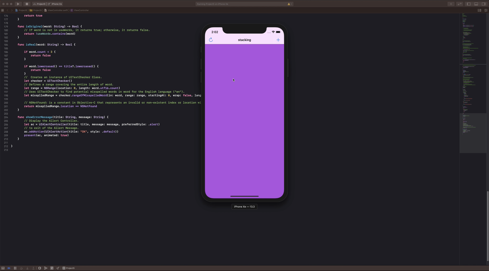
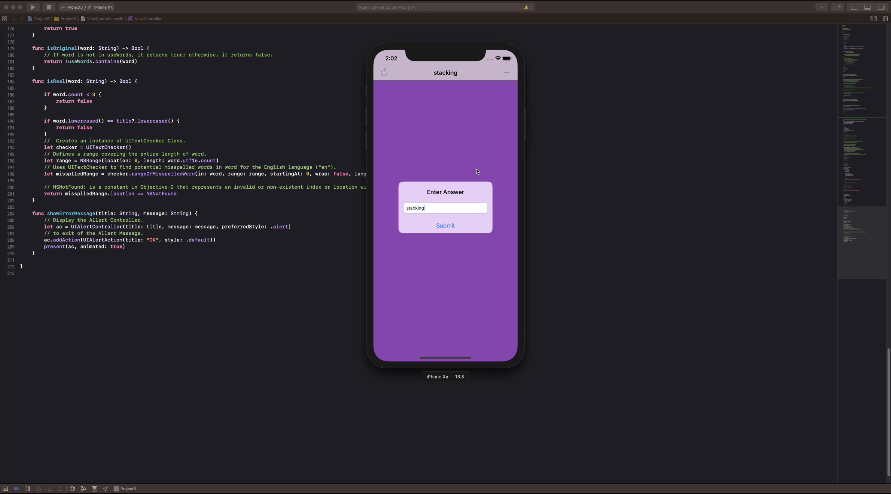
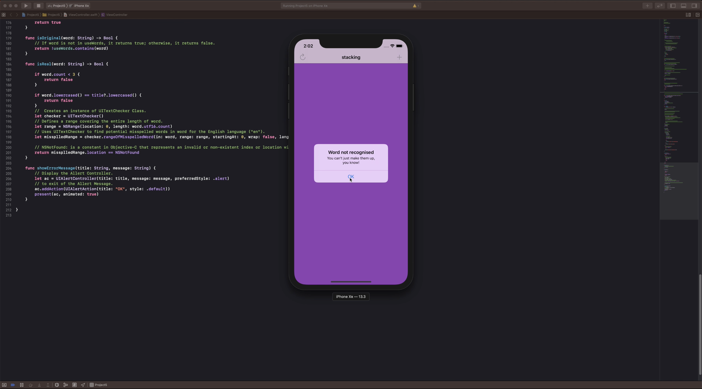
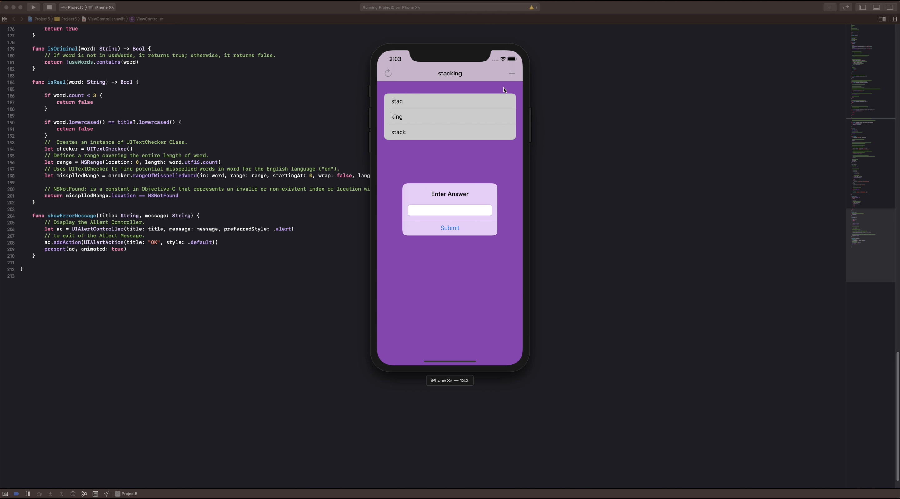

# UIKit

 ### I learned more about UITableView: how to reload their data and insert rows. 
 ### I also learned how to add text fields to UIAlertController so that I can accept user input. and some serious core stuff: Swift strings, closures, NSRange, ARC (Automatic Reference Counting) is a technology used in programming languages, specifically in Objective-C and Swift that automates the process of memory management.

# Day 28, 29

